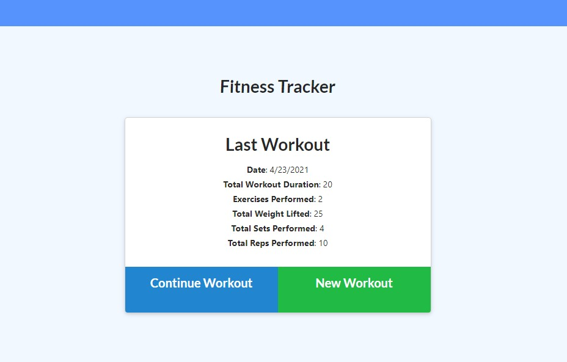
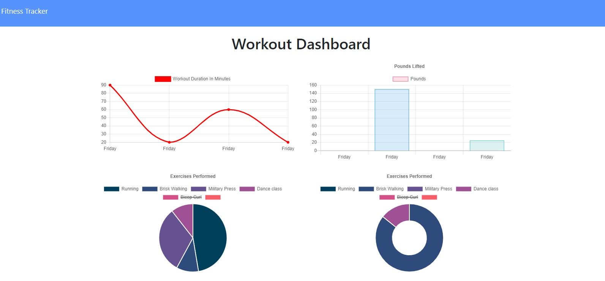

# Fitness Tracker

## Requirements:
When the user loads the page, they should be given the option to create a new workout or continue with their last workout.
  
The user should be able to:  
  
- Add exercises to the most recent workout plan.
- Add new exercises to a new workout plan.
- View the combined weight of multiple exercises from the past seven workouts on the `stats` page.
- View the total duration of each workout from the past seven workouts on the `stats` page.

## Execution:
Almost all of the front-end code was given as starter code, the challenge was in setting up the back-end and getting things connected. This involved
- File structure
    * Routes folder containing separate files for view and API routes
    * Models folder--this contains the workout model as well as an index.js. The index.js file was needed to use the given seed file to seed the database, and would come in handy if other models need to be added in future development
- View routes for serving up the correct html files in the right places, using the html files themselves as a refrence to figure out what goes where and what to call it
- API routes for getting, posting, and editing the workout data
    * These had to include the MongoDB aggregate function to total up some of the workout stats and add fields to store those totals

## Challenges:
The main challenge running through this assignment was finding the information in the front-end files given that was needed to build out the back-end. It was kind of like putting together a puzzle while also making some of the pieces from scratch. It takes some trial and error to make them fit.
- View routes were tricky to figure out only because the app always wants to find and display the index.html, so that would work even when the routes were all tangled up
- Matching up the pieces--it took way to long to figure out that the field used on the model to store a time/datestamp was referenced elsewhere as "Day", not "Date"
- Sorting out the aggregation in the API routes using $addFields and the $sum operator 
- Remembering to commit as soon as any feature worked properly

[Deployed App](https://calm-lake-23955.herokuapp.com/)

## Screenshots
  

